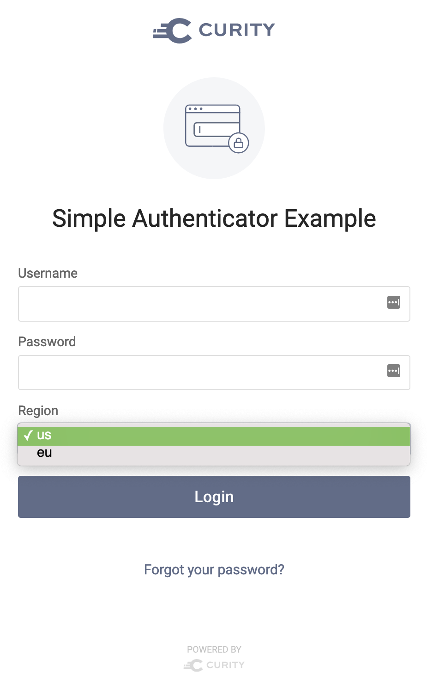
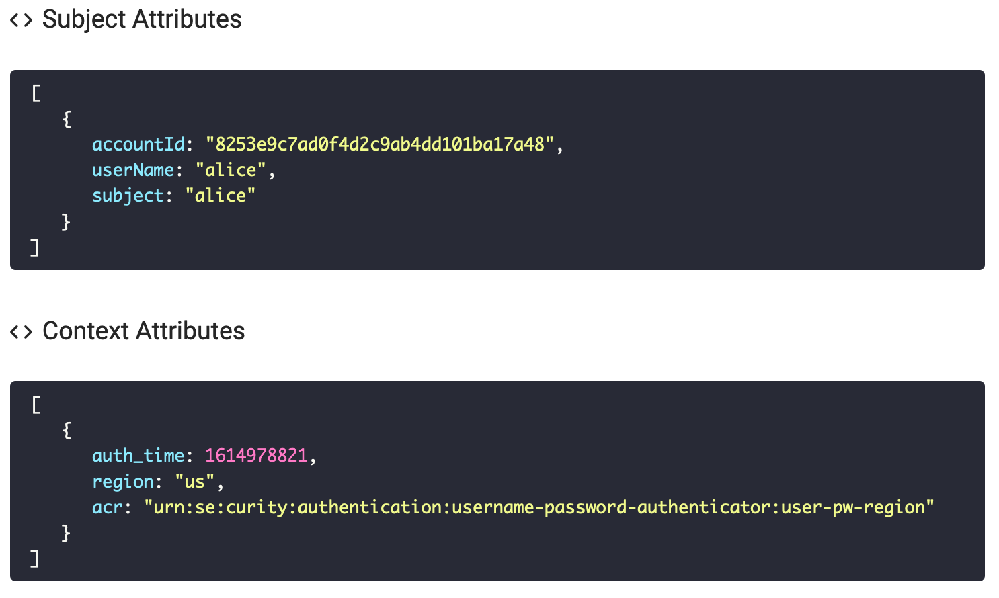
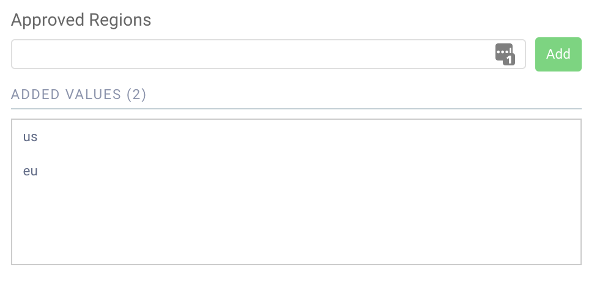

# Username/Password HTML Form Authenticator Plugin Example #

[](https://curity.io/resources/code-examples/status/)
[](https://curity.io/resources/code-examples/status/)

This is a sample Authenticator plugin for the Curity Identity Server.

It demonstrates how to build a simple plugin that can be used to authenticate users via a HTML form with username and password. The Authenticator also showcase an additional custom attribute (region) as part of the authentication. The region input is in the form of a drop-down list.



The selected region will be added as a region attribute in the Context attributes.



The region drop-down list in the authentication login screen is populated from the list of approved regions in the Authenticator configuration. 


The list of regions is sent in the response using the `putViewData` method.

```java
response.putViewData("REGIONS", _regions, Response.ResponseModelScope.ANY);
``` 

This allows the REGIONS to be accessible in the authenticator template via `$_context.REGIONS`. The template iterates over the configured regions and populates the drop-down list.

```
    #set($regions = $_context.REGIONS)
    #foreach($region in $regions)
        <option value=$region>$region</option>
    #end
```


Please visit [curity.io](https://curity.io/) for more information about the Curity Identity Server.
