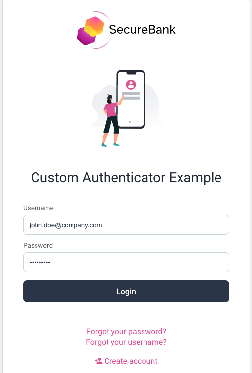

# Username/Password Authenticator Plugin Example

[](https://curity.io/resources/code-examples/status/)
[](https://curity.io/resources/code-examples/status/)

The Curity Identity Server has a built-in [HTML Form Authenticator](https://curity.io/docs/idsvr/latest/authentication-service-admin-guide/authenticators/html.html).\
This example plugin provides a similar implementation using the Curity SDK.

## Customization

The [Branding and User Experience Resources](https://curity.io/resources/branding-user-experience/) provide example customizations.\
In more advanced scenarios you may also want to take closer control over runtime behavior.\
For these cases, you can use this repo as a starting point and adapt it as required.

## Prerequisites

Before using this plugin you must be running version 9.0 or later of the Curity Identity Server.\
Also ensure that you are using [credential_mode=standard](https://curity.io/docs/idsvr/latest/system-admin-guide/data-sources/jdbc.html#credential-modes).\
This requires username and password storage to be separated into `accounts` and `credentials` tables.\
If you are using older credential storage, use v1.0 of this repo instead.

## Example Deployment

An [example deployment](test/README.md) is provided that uses the plugin, with an example custom look and feel.\
Behavior is largely the same as the built-in HTML Form authenticator, and covers the entire user journey.



## Behavior of Flows

A number of flows are available, to manage self sign-up, authentication and account recovery.\
Each of these are described, with screenshots and plugin coding details, in the below documents:

- [Authentication](doc/authentication.md)
- [Create Account](doc/create-account.md)
- [Activate Account](doc/activate-account.md)
- [Activate and Set Password](/doc/activate-set-password.md)
- [Forgot Username](doc/forgot-username.md)
- [Forgot Password](doc/forgot-password.md)
- [Set Password](doc/set-password.md)

## Deploying the Plugin

Follow the below steps to run this plugin in your own instances of the Curity Identity Server.

### Update Java Libraries

When deployed to the Curity Identity Server, the plugin will use shared Java libraries.\
Identify the versions of these libraries that match your version of the Curity Identity Server.\
This can be done by viewing the [Service Provided Dependencies](https://curity.io/docs/idsvr/latest/developer-guide/plugins/index.html#server-provided-dependencies) page for your version.\
Then update the `pom.xml` file of this project with matching versions.

### Build the JAR Files

Ensure that JDK 17 or later is installed, and also the [maven build tool](https://maven.apache.org/install.html).\
Then build the plugin code with this command:

```bash
mvn package
```

Next gather the following files from the `target` folder:

```text
identityserver.plugins.authenticators.usernamepassword-*.jar
gson-*.jar
guava-*.jar
commons-lang*.jar
```

### Deploy the JAR Files

Deploy JAR files to your instances of the Curity Identity Server, in a plugins subfolder:

```text
$IDSVR_HOME/usr/share/plugins/usernamepasswordauthenticator/*.jar
```

### Use the Plugin

In the Admin UI, create an instance of the `Username Password Authenticator` to use in your applications:


## SDK Links

- Read the [Plugins Developer Guide](https://curity.io/docs/idsvr/latest/developer-guide/plugins/index.html) for an overview of behavior
- Search the [Curity Identity Server Plugin SDK](https://curity.io/docs/idsvr-java-plugin-sdk/latest/) to better understand SDK objects
- See the [Plugin Code Examples](https://curity.io/resources/plugins-authenticators/) for many existing plugins to compare against

## Further Information

Please visit [curity.io](https://curity.io/) for more information about the Curity Identity Server.
