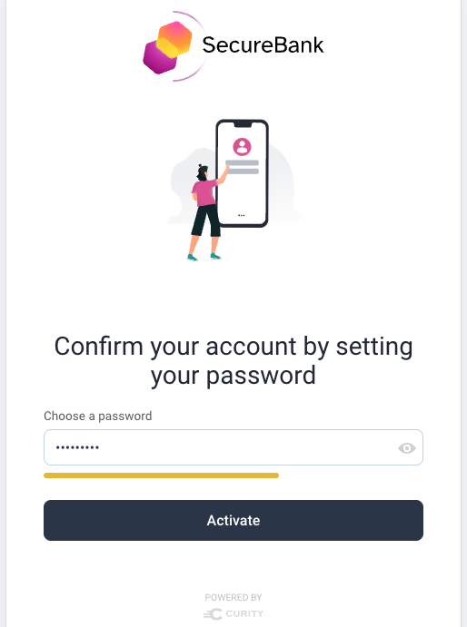
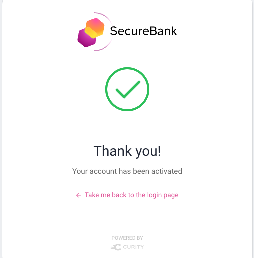
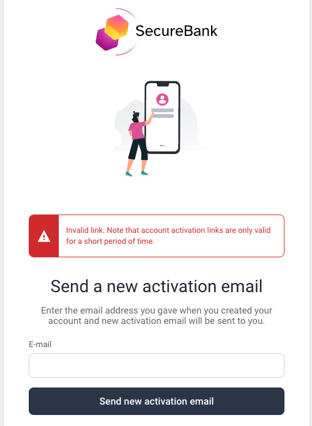
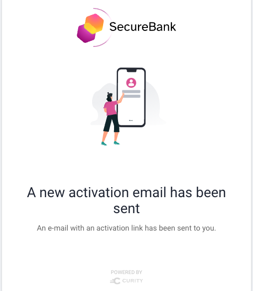

# Activate and Set Password Flow

This flow is used when a user creates an account and then needs to verify their email address.\
It is a two part flow that includes the use of one time tokens:

- The [Create Account](create-account.md) sends an activate account email
- The activate account flow runs when the link is clicked

There are two ways to configure account activation and this page describes the second of these:

- The user clicks an email link
- Or the user clicks an email link then enters their password

The first method is described in the [Activate Account](activate-account.md) page.

## Technical Behavior

The user first receives an email link such as the following, including a one time token, or `nonce`.\
This nonce and the account ID are stored in a data source, with a time to live configured in the account manager.

```text
https://idsvr.example.com/authn/anonymous/usernamepassword/activate-and-set?token=CRLUnySdgDvLmbV2zdeXgUvZ60rUTut6
```

## Successful Activation

If the email link is valid, then the account is activated and the user is prompted to set a password:



At this point the account is activated and the user may login to your application:



## Unsuccessful Activation

If the email link is invalid or expired, the following screen is shown, to enable the user to recover.\
The user can then enter their email address to trigger resending of an email link:



This screen can be retriggered at any time by browsing to a URL of the following form:

```text
https://idsvr.example.com/authn/anonymous/usernamepassword/activate-and-set?token=xxx
```

## Resent Activation Link

When an activation link is resent, the user is presented with the following screen.\
The user will then receive the same type of email link as previously, and will be able to retry:



## Resuming Logins

If the same browser is used for create and activate acount, the application login can be resumed.\
Otherwise it cannot, since both the SSO session cookie and the application pre-login state will be missing.

## Code Behavior

The [Request Handler](../src/main/java/io/curity/identityserver/plugin/usernamepassword/activateAccount/UsernamePasswordActivateAndSetPasswordRequestHandler.java) provides the plugin logic for this flow.\
This class is injected with the following SDK objects, which implement its main behavior:

| SDK Object | Usage |
| ---------- | ----- |
| [AccountManager](https://curity.io/docs/idsvr-java-plugin-sdk/latest/se/curity/identityserver/sdk/service/AccountManager.html) | Used to get the account object from the account ID |
| [AuthenticatorInformationProvider](https://curity.io/docs/idsvr-java-plugin-sdk/latest/se/curity/identityserver/sdk/service/authentication/AuthenticatorInformationProvider.html) | Used to calculate the full URL to send in the email link |

The following resources can be customized as required:

- [Set Password View Template](../src/main/resources/templates/authenticator/username-password-authenticator/account-activation/set-password.vm)
- [Success View Template](../src/main/resources/templates/authenticator/username-password-authenticator/account-activation/success.vm)
- [Request New Email View Template](../src/main/resources/templates/authenticator/username-password-authenticator/account-activation/request-new-activation.vm)
- [Resent View Template](../src/main/resources/templates/authenticator/username-password-authenticator/account-activation/resent.vm)
- [View Template Localizable Text](../src/main/resources/messages/en/authenticator/username-password-authenticator/account-activation/messages)
