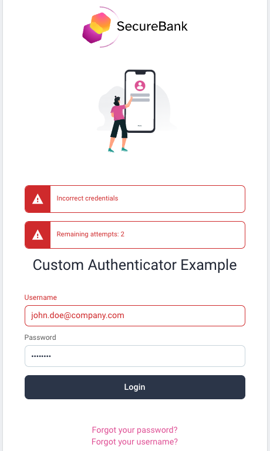

# Authentication Flow

This summary walks through the screens and code paths for the entry point authentication flow.\
As well as managing signing in, this also links to signup and account recovery operations.

## Initial Screen

The entry point to the authentication flow is shown below, when an application triggers an OpenID Connect redirect.\
The page is invoked via a GET request to a URL with this format: `/authn/authentication/usernamepassword`:

## The Account Manager

The behavior of the Username Password Authenticator is influenced by Account Manager settings:

| Setting | Behavior |
| ------- | -------- |
| Username is email | When configured, the user must enter their email address when signing in. This makes the value easy for users to remember, but this may not be supported for some data sources. |
| Enable Registration | This enables new users to sign themselves up, or can be deselected when this should not be allowed. In the latter case the `Create Account` link will not be shown. |

## Links to Other Operations

In some cases the user may need to perform another action before they are able to authenticate.\
The authentication page therefore provides links to these flows, though Create Account may be hidden:

- [Create Account](create-account.md)
- [Forgot Username](forgot-username.md)
- [Forgot Password](forgot-password.md)

## Username Behavior

If the username is found in the username server-side cookie, it will be restored, otherwise it will be blank.\
If the password has been previously saved by the user, the browser will autofill it, otherwise it will be blank.

## Input Validation

If invalid credentials are entered, the screen is not submitted and the user must correct their input:

## Successful Login

After authentication, a username cookie is written by the user preferences manager.\
The browser may also prompt the user to save their password.\
If accepted, then password autofill will work on subsequent logins.

## Code Behavior

The [RequestHandler](../src/main/java/io/curity/identityserver/plugin/usernamepassword/authentication/UsernamePasswordAuthenticationRequestHandler.java) provides the plugin logic for this flow.\
This class is injected with the following SDK objects, which implement its main behavior:

| SDK Object | Usage |
| ---------- | ----- |
| [AccountManager](https://curity.io/docs/idsvr-java-plugin-sdk/latest/se/curity/identityserver/sdk/service/AccountManager.html) | Used to determine whether to display a Create Account link |
| [UserCredentialManager](https://curity.io/docs/idsvr-java-plugin-sdk/latest/se/curity/identityserver/sdk/service/AccountManager.html) | Used to validate the username and password entered |
| [UserPreferenceManager](https://curity.io/docs/idsvr-java-plugin-sdk/latest/se/curity/identityserver/sdk/service/UserPreferenceManager.html) | Used to load the username before authentication, and save it afterwards |

The following resources can be customized as required:

- [Get View Template](../src/main/resources/templates/authenticator/username-password-authenticator/authenticate/get.vm)
- [View Template Localizable Text](../src/main/resources/messages/en/authenticator/username-password-authenticator/authenticate/messages)
