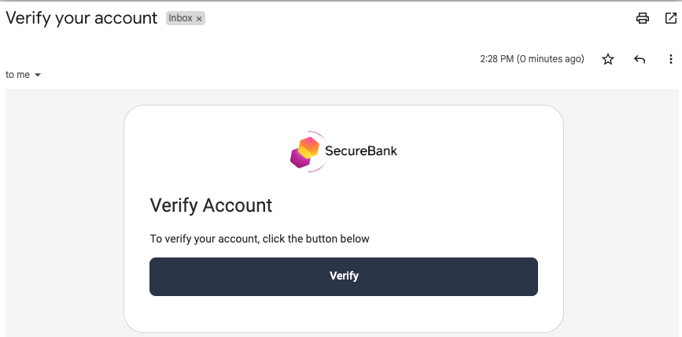

# Create Account Flow

This flow is used in scenarios where users are able to register their own account.

## The Account Manager

The behavior of Create Account is influenced by the plugin's Account Manager settings:

| Setting | Behavior |
| ------- | -------- |
| Enable Registration | This enables new users to sign themselves up, or can be deselected when this should not be allowed |
| Account Verification Method | When set to `email-verification`, users must click an email link after sign up |
| Set Password after Activation | When configured, no password field is shown and the password is instead set after activation |
| Username is Email | When this is set, the user must enter an email in the usernmame field and the email field is not shown |
| Email Provider | The email provider configured against the account manager is used for activation emails |

## Initial Screen

The entry point to the create account flow is shown below.\
The page is invoked via a GET request to a URL with this format: `/authn/registration/usernamepassword`.

## Input Validation

In the event of invalid input being provided, a suitable error message is displayed.\
The user's form input is maintained, with the exception of the password and terms:

## Successful Account Creation

The following screen is rendered once the account is created, if email activation is not needed.\
The user can then return to the login screen and immediately sign in to the application:

## Account Creation with Email Activation

When verification is needed, the user must activate their account before signing in:

The user then receives an email and must click the link to activate their account:

For details on how activation continues, see the following pages:

- [Activate Account](activate-account.md)
- [Activate and Set Password](activate-set-password.md)

## Code Behavior

The [Request Handler](../src/main/java/io/curity/identityserver/plugin/usernamepassword/registration/UsernamePasswordRegistrationRequestHandler.java) provides the plugin logic for this flow.\
This class is injected with the following SDK objects, which implement its main behavior:

| SDK Object | Usage |
| ---------- | ----- |
| [Credential Manager](https://curity.io/docs/idsvr-java-plugin-sdk/latest/se/curity/identityserver/sdk/service/CredentialManager.html) | Used to transform the password entered to a secure format |
| [Account Manager](https://curity.io/docs/idsvr-java-plugin-sdk/latest/se/curity/identityserver/sdk/service/AccountManager.html) | Used to determine which fields to show, and to persist the account details entered |
| [UserPreferenceManager](https://curity.io/docs/idsvr-java-plugin-sdk/latest/se/curity/identityserver/sdk/service/UserPreferenceManager.html) | Used to write a username cookie after registration, so that it is automatically populated during authentication |
| [AuthenticatorInformationProvider](https://curity.io/docs/idsvr-java-plugin-sdk/latest/se/curity/identityserver/sdk/service/authentication/AuthenticatorInformationProvider.html) | Used to calculate the full URL to send in activation email links |

The following resources can be customized as required:

- [Get View Template](../src/main/resources/templates/authenticator/username-password-authenticator/create-account/get.vm)
- [Post View Template](../src/main/resources/templates/authenticator/username-password-authenticator/create-account/post.vm)
- [View Template Localizable Text](../src/main/resources/messages/en/authenticator/username-password-authenticator/create-account/messages)
- [Email Template](../src/main/resources/templates/authenticator/username-password-authenticator/email/verify-account/email.vm) 
- [Email Template Localizable Text](../src/main/resources/messages/en/authenticator/username-password-authenticator/email/verify-account/messages)
