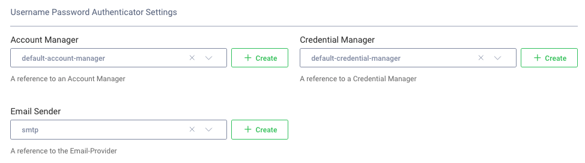
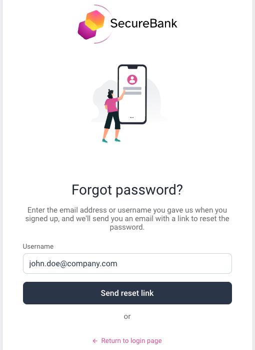
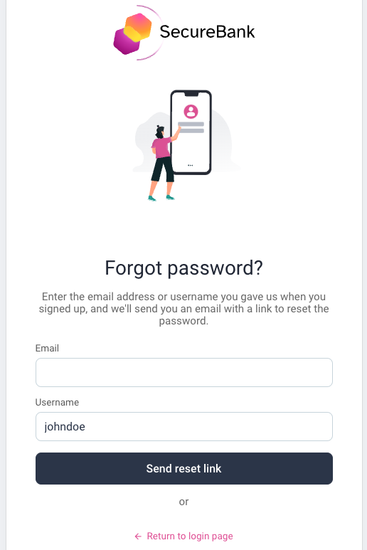
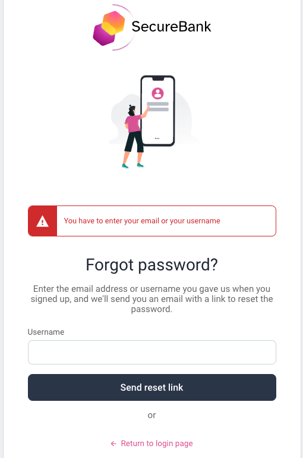
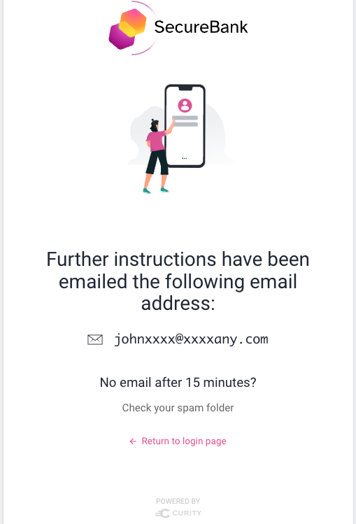
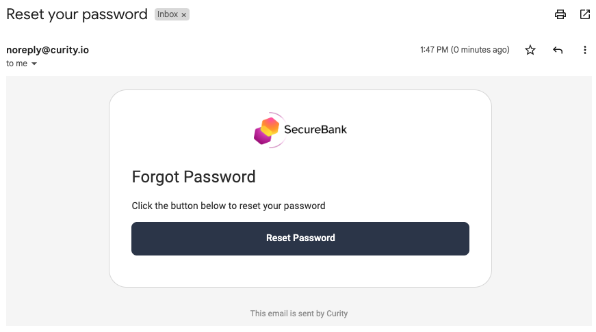

# Forgot Password Flow

This flow is used when a user forgets their password.\
The user must then enter their email address and will receive a one-time code (OTP) in an email.

## Overview

This is a two-part flow that includes the use of one time tokens:

- The forgot password flow generates an OTP, emails it to the user, and is described in this document
- The [set password](set-password.md) flow runs when the user enters the OTP

## Prerequisites

The plugin must first be configured with an email provider in its settings:

The plugin also uses a Throttler service to limit how often the reset email is sent and how often OTPs can be verified.\
Sending is throttled per account, or per entered username or email when no account is found, so both cases behave the same.\
When sending is throttled, no email is sent, any OTP already sent remains valid, and the user is asked to try again later.\
If no throttler is configured, the server's default throttler is used.\
The time the OTP is valid for can be set with the `OTP Time To Live` setting, in seconds.

## Initial Screen

The entry point to the forgot password flow is shown below.\
The page is invoked via a GET request to a URL with this format: `/authn/authentication/forgot-password`:

If `Username is email` is not set in the Account Manager, either field can be entered:

## Input Validation

If no input is entered, the form is not submitted.\
Non-existing and existing values are both accepted, as a best security practice.

## After Submission

The following screen is rendered:

## Email Received

An email will then be received that provides the OTP and a link to the page where it must be entered:

## Technical Behavior

The forgot password flow generates a one time token, or `nonce`, which holds the account ID and expires after the configured `OTP Time To Live` (20 minutes by default).\
It also generates a 6-digit OTP, which is sent in the email.\
The nonce and a hash of the OTP, bound to the session ID, are saved in session data.\
The nonce itself is never sent to the user, so the OTP can only be used in the browser that requested it.\
Any OTP previously issued in the same session is invalidated.\
If no account is found, a decoy OTP that can never be verified is stored instead, so that the flow behaves the same way.

See [OtpHelper](../src/main/java/io/curity/identityserver/plugin/usernamepassword/utils/OtpHelper.java).

## Code Behavior

The [RequestHandler](../src/main/java/io/curity/identityserver/plugin/usernamepassword/forgotPassword/UsernamePasswordForgotPasswordRequestHandler.java) provides the plugin logic for this flow.\
This class is injected with the following SDK objects, which implement its main behavior:

| SDK Object | Usage |
| ---------- | ----- |
| [AccountManager](https://curity.io/docs/idsvr-java-plugin-sdk/latest/se/curity/identityserver/sdk/service/AccountManager.html) | Used to find the account for the username or email entered |
| [NonceTokenIssuer](https://curity.io/docs/idsvr-java-plugin-sdk/latest/se/curity/identityserver/sdk/service/NonceTokenIssuer.html) | Used to issue the nonce and save it to the data source against the account |
| [SessionManager](https://curity.io/docs/idsvr-java-plugin-sdk/latest/se/curity/identityserver/sdk/service/SessionManager.html) | Used to store the nonce and the OTP hash |
| [Throttler](https://curity.io/docs/idsvr-java-plugin-sdk/latest/se/curity/identityserver/sdk/service/Throttler.html) | Used to throttle sending the reset email and OTP verification attempts |
| [EmailSender](https://curity.io/docs/idsvr-java-plugin-sdk/latest/se/curity/identityserver/sdk/service/EmailSender.html) | Used to send the forgot password email |
| [UserPreferenceManager](https://curity.io/docs/idsvr-java-plugin-sdk/latest/se/curity/identityserver/sdk/service/UserPreferenceManager.html) | Used to default the username to the previously saved value |
| [AuthenticatorInformationProvider](https://curity.io/docs/idsvr-java-plugin-sdk/latest/se/curity/identityserver/sdk/service/authentication/AuthenticatorInformationProvider.html) | Used to calculate the full URL when sending an email link |

The following resources can be customized as required:

- [Get View Template](../src/main/resources/templates/authenticator/username-password-authenticator/forgot-password/get.vm)
- [Post View Template](../src/main/resources/templates/authenticator/username-password-authenticator/forgot-password/post.vm)
- [View Template Localizable Text](../src/main/resources/messages/en/authenticator/username-password-authenticator/forgot-password/messages)
- [Email Template](../src/main/resources/templates/authenticator/username-password-authenticator/email/forgot-password/email.vm) 
- [Email Template Localizable Text](../src/main/resources/messages/en/authenticator/username-password-authenticator/email/forgot-password/messages)
