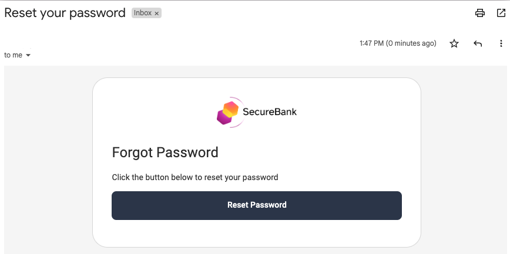

# Forgot Password Flow

This flow is used when a user forgets their password.\
The user must then enter their email address and will receive a reset password link in an email.

## Overview

This is a two-part flow that includes the use of one time tokens:

- The forgot password flow generates a reset password link and is described in this document
- The [set password](set-password.md) flow runs when the link is clicked

## Prerequisites

The plugin must first be configured with an email provider in its settings:

## Initial Screen

The entry point to the forgot password flow is shown below.\
The page is invoked via a GET request to a URL with this format: `/authn/authentication/forgot-password`:

If `Username is email` is not set in the Account Manager, either field can be entered:

## Input Validation

If no input is entered, the form is not submitted.\
Non-existing and existing values are both accepted, as a best security practice.

## After Submission

The following screen is rendered:

## Email Received

An email will then be received that provides the reset password link:

## Technical Behavior

The forgot password flow generates a one time token, or `nonce`.\
This is included in the above email as a query parameter for the reset password URL.\
The token and the account ID are then saved in session data, to the configured data source.

## Code Behavior

The [RequestHandler](../src/main/java/io/curity/identityserver/plugin/usernamepassword/forgotPassword/UsernamePasswordForgotPasswordRequestHandler.java) provides the plugin logic for this flow.\
This class is injected with the following SDK objects, which implement its main behavior:

| SDK Object | Usage |
| ---------- | ----- |
| [UserPreferenceManager](https://curity.io/docs/idsvr-java-plugin-sdk/latest/se/curity/identityserver/sdk/service/UserPreferenceManager.html) | Used to default the username to the previously saved value |
| [AccountManager](https://curity.io/docs/idsvr-java-plugin-sdk/latest/se/curity/identityserver/sdk/service/AccountManager.html) | Used to find the account for the username or email entered |
| [NonceTokenIssuer](https://curity.io/docs/idsvr-java-plugin-sdk/latest/se/curity/identityserver/sdk/service/NonceTokenIssuer.html) | Used to issue the nonce and save it to the data source against the account |
| [AuthenticatorInformationProvider](https://curity.io/docs/idsvr-java-plugin-sdk/latest/se/curity/identityserver/sdk/service/authentication/AuthenticatorInformationProvider.html) | Used to calculate the full URL to send in the email link |
| [EmailSender](https://curity.io/docs/idsvr-java-plugin-sdk/latest/se/curity/identityserver/sdk/service/EmailSender.html) | Used to send the forgot password email |

The following resources can be customized as required:

- [Get View Template](../src/main/resources/templates/authenticator/username-password-authenticator/forgot-password/get.vm)
- [Post View Template](../src/main/resources/templates/authenticator/username-password-authenticator/forgot-password/post.vm)
- [View Template Localizable Text](../src/main/resources/messages/en/authenticator/username-password-authenticator/forgot-password/messages)
- [Email Template](../src/main/resources/templates/authenticator/username-password-authenticator/email/forgot-password/email.vm) 
- [Email Template Localizable Text](../src/main/resources/messages/en/authenticator/username-password-authenticator/email/forgot-password/messages)
