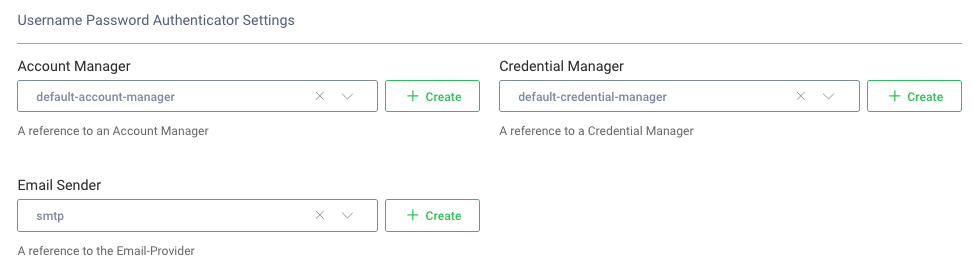
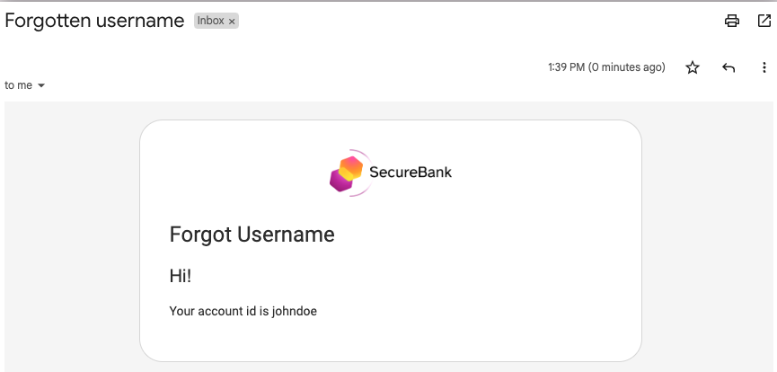

# Forgot Username Flow

This flow is used in setups where a user logs in with a username different to their email address.\
The user must then enter their email address and will receive their username in an email.

## Prerequisites

The plugin must first be configured with an email provider in its settings:

## Initial Screen

The entry point to the forgot username flow is shown below.\
The page is invoked via a GET request to a URL such as `/authn/authentication/forgot-account-id`:

## Input Validation

The input is only accepted if the value entered is a valid email regular expression.\
Non-existing and existing values are both accepted, as a best security practice.

## After Submission

The following screen is rendered:

## Email Received

An email will then be received that provides the username:

## Code Behavior

The [Request Handler](../src/main/java/io/curity/identityserver/plugin/usernamepassword/forgotAccountId/UsernamePasswordForgotAccountIdRequestHandler.java) provides the plugin logic for this flow.\
This class is injected with the following SDK objects, which implement its main behavior:

| SDK Object | Usage |
| ---------- | ----- |
| [AccountManager](https://curity.io/docs/idsvr-java-plugin-sdk/latest/se/curity/identityserver/sdk/service/AccountManager.html) | Used to find the account for the email entered |
| [AuthenticatorInformationProvider](https://curity.io/docs/idsvr-java-plugin-sdk/latest/se/curity/identityserver/sdk/service/authentication/AuthenticatorInformationProvider.html) | Used to calculate the full URL to send in the email link |
| [EmailSender](https://curity.io/docs/idsvr-java-plugin-sdk/latest/se/curity/identityserver/sdk/service/EmailSender.html) | Used to send the forgot username email |

The following resources can be customized as required:

- [Get View Template](../src/main/resources/templates/authenticator/username-password-authenticator/forgot-account-id/get.vm)
- [Post View Template](../src/main/resources/templates/authenticator/username-password-authenticator/forgot-account-id/post.vm)
- [View Template Localizable Text](../src/main/resources/messages/en/authenticator/username-password-authenticator/forgot-account-id/messages)
- [Email Template](../src/main/resources/templates/authenticator/username-password-authenticator/email/forgot-account-id/email.vm) 
- [Email Template Localizable Text](../src/main/resources/messages/en/authenticator/username-password-authenticator/email/forgot-account-id/messages)