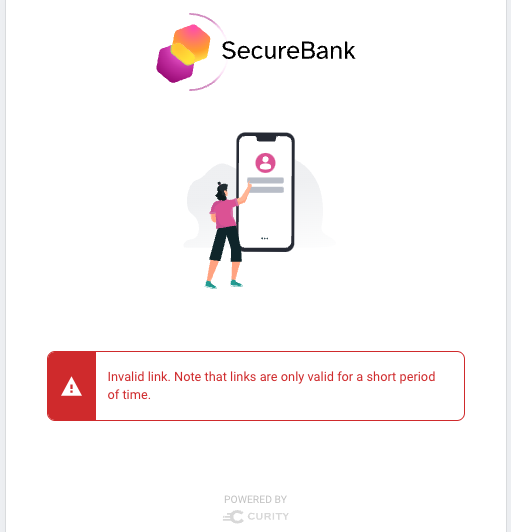
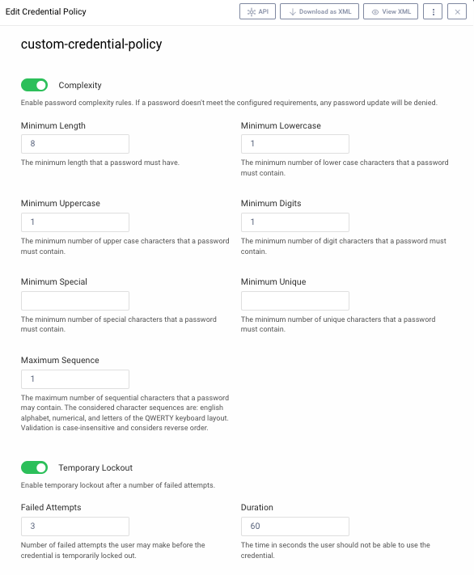
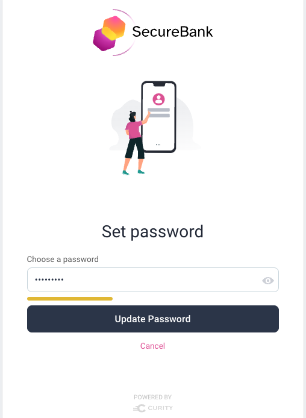
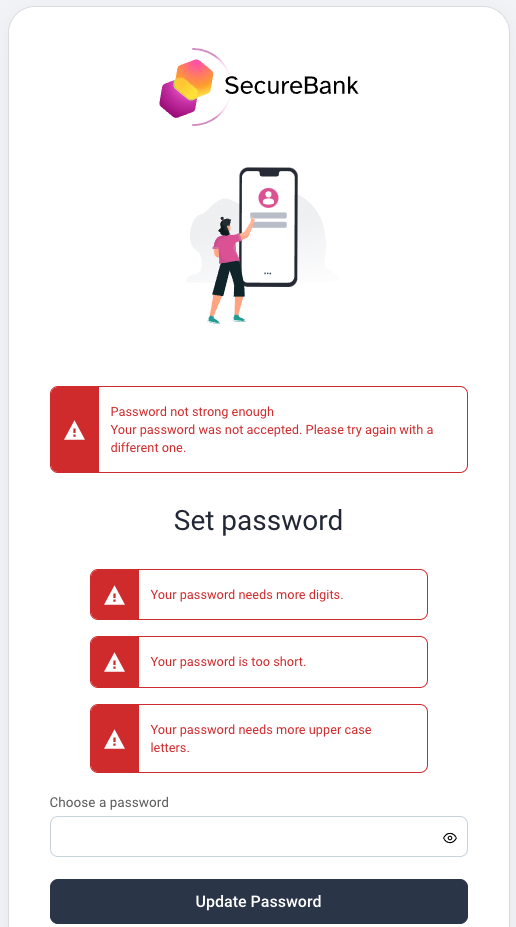
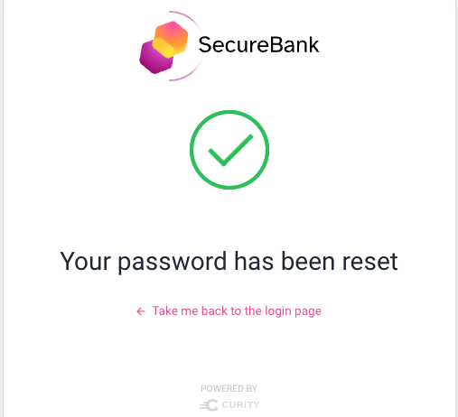

# Set Password Flow

This flow is used when a user forgets their password during login.\
It is a two part flow that includes the use of one time tokens:

- The [forgot password](forgot-password.md) flow generates a reset password email with a link
- The set password flow runs when the link is clicked, and is described here

## URL Behavior

The user first receives an email link such as the following, including a one time token, or `nonce`.\
This nonce is stored in a data source, along with the account ID, with a time to live of 20 minutes.

```text
https://idsvr.example.com/authn/anonymous/usernamepassword/set-password?token=srW2pTinSx3s4ecTv1ncZ8zzBXfPibBK
```

## Expired Links

If the email link is clicked at a time after 20 minutes, the following error is displayed:



## The Credential Policy

A Credential Policy is optional but if configured these rules will be enforced:



## Set Password Screen

If the link is valid then the set password screen is invoked via a URL with this format: `/authn/authentication/set-password`.\
The user then enters a new password and the indicator shows the password strength:



If the new password fails the password policy a screen of the following form is shown and the user can retry:



Once the password is updated, the following screen is displayed.\
The user can then return to the login screen and sign in to the application.



## Anonymous Access

In some setups the Set Password flow can be run in a different browser to the one that ran Forgot Password.\
Therefore an anonymous page is used, which does not require a session cookie.

## Resuming Logins

If the same browser is used for forgot and set password, the application login can be resumed.\
Otherwise it cannot, since both the SSO session cookie and the application pre-login state will be missing.

## Technical Behavior

When the email link is invoked, the token is looked up in the data source.\
The lookup is done via an introspection request, which also removes it from the data source.\
The token and account ID are then saved to session data, which is backed by a browser cookie.\
This ensures that if a user accidentally closes the password reset page they can retry without errors.

## Code Behavior

The [Request Handler](../src/main/java/io/curity/identityserver/plugin/usernamepassword/setPassword/UsernamePasswordAuthenticatorSetPasswordRequestHandler.java) provides the plugin logic for this flow.\
This class is injected with the following SDK objects, which implement its main behavior:

| SDK Object | Usage |
| ---------- | ----- |
| [NonceTokenIssuer](https://curity.io/docs/idsvr-java-plugin-sdk/latest/se/curity/identityserver/sdk/service/NonceTokenIssuer.html) | Used to introspect the nonce received in the URL and get the account ID |
| [AccountManager](https://curity.io/docs/idsvr-java-plugin-sdk/latest/se/curity/identityserver/sdk/service/AccountManager.html) | Used to get the account object from the account ID |
Used to transform the password entered to a secure format
| [UserCredentialManager](https://curity.io/docs/idsvr-java-plugin-sdk/latest/se/curity/identityserver/sdk/service/credential/UserCredentialManager.html) | Used to update the password in the configured data source |
| [SessionManager](https://curity.io/docs/idsvr-java-plugin-sdk/latest/se/curity/identityserver/sdk/service/SessionManager.html) | Used to cache the nonce data after introspection, to support retries |

The following resources can be customized as required:

- [Get View Template](../src/main/resources/templates/authenticator/username-password-authenticator/set-password/get.vm)
- [Post View Template](../src/main/resources/templates/authenticator/username-password-authenticator/set-password/post.vm)
- [View Template Localizable Text](../src/main/resources/messages/en/authenticator/username-password-authenticator/set-password/messages)
