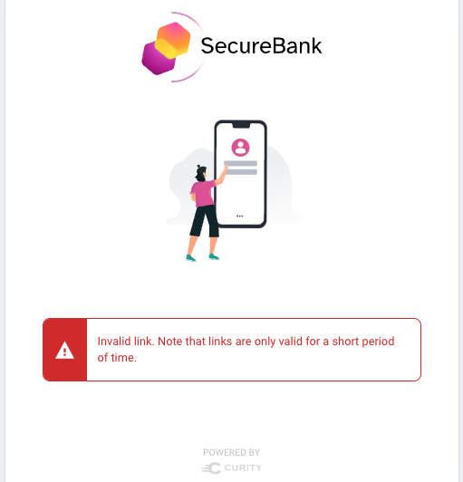
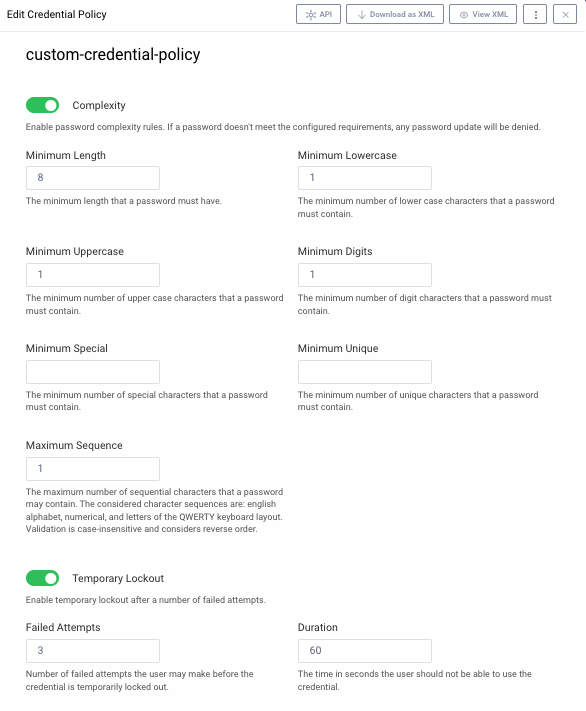
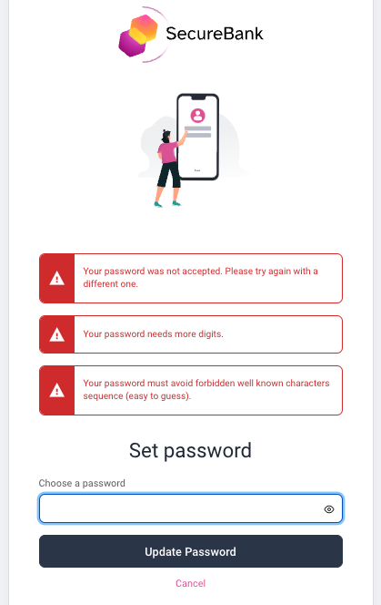

# Set Password Flow

This flow is used when a user forgets their password during login.\
It is a two part flow that includes the use of one time tokens:

- The [forgot password](forgot-password.md) flow generates a reset password email with a one-time code (OTP)
- The set password flow runs when the user enters the OTP, and is described here

## URL Behavior

The user first receives an email with an OTP and a link such as the following.\
The same page is also linked from the screen shown after submitting the forgot password form.

```text
https://idsvr.example.com/authn/anonymous/usernamepassword/set-password
```

The page first asks for the OTP. Once it is accepted, the page asks for the new password.\
The OTP is valid for the configured `OTP Time To Live` (20 minutes by default) and allows 5 attempts, after which a new one must be requested.\
Attempts are also throttled per account (ignoring case) by the configured Throttler service (the default throttler unless one is configured).\
When throttled, the user is asked to try again later, even if the OTP is correct.

## Expired Codes

If the OTP has expired, too many wrong attempts were made, or no OTP was requested in this browser, the following error is displayed:



## The Credential Policy

A Credential Policy is optional but if configured these rules will be enforced:



## Set Password Screen

If the OTP is valid then the set password screen is shown. The page is invoked via a URL with this format: `/authn/anonymous/<authenticator-id>/set-password`.\
The user then enters a new password which may need to meet a credential policy.\
If this fails a screen of the following form is shown and the user can retry:



Once the password is updated, the following screen is displayed.\
The user can then return to the login screen and sign in to the application.


## Anonymous Access

The Set Password page is an anonymous page, so it can be reached without an ongoing login.\
It still relies on session data, since the OTP is bound to the session in which it was requested.\
The OTP must therefore be entered in the same browser that ran Forgot Password.

## Resuming Logins

Since the same browser is used for forgot and set password, the application login can be resumed.

## Technical Behavior

When the OTP is submitted, the nonce is first looked up in the data source, via an introspection request which also removes it.\
This ensures that concurrent attempts cannot check more than one OTP per nonce.\
The OTP is then compared with the salted hash stored in session data.\
If it is wrong, a new nonce with the same expiration time replaces the old one, until no attempts are left.\
If it is correct, the account ID is saved to session data, which is stored on the server and referenced by the session cookie.\
The user then has as long as the OTP was valid for to set the new password.\
This ensures that if a user accidentally closes the password reset page they can retry without errors.

## Code Behavior

The [Request Handler](../src/main/java/io/curity/identityserver/plugin/usernamepassword/setPassword/UsernamePasswordSetPasswordRequestHandler.java) provides the plugin logic for this flow.\
This class is injected with the following SDK objects, which implement its main behavior:

| SDK Object | Usage |
| ---------- | ----- |
| [NonceTokenIssuer](https://curity.io/docs/idsvr-java-plugin-sdk/latest/se/curity/identityserver/sdk/service/NonceTokenIssuer.html) | Used to introspect the nonce once the OTP is verified and get the account ID |
| [AccountManager](https://curity.io/docs/idsvr-java-plugin-sdk/latest/se/curity/identityserver/sdk/service/AccountManager.html) | Used to get the account object from the account ID |
Used to transform the password entered to a secure format
| [UserCredentialManager](https://curity.io/docs/idsvr-java-plugin-sdk/latest/se/curity/identityserver/sdk/service/credential/UserCredentialManager.html) | Used to update the password in the configured data source |
| [SessionManager](https://curity.io/docs/idsvr-java-plugin-sdk/latest/se/curity/identityserver/sdk/service/SessionManager.html) | Used to hold the pending OTP, and the account ID once the OTP is verified |
| [Throttler](https://curity.io/docs/idsvr-java-plugin-sdk/latest/se/curity/identityserver/sdk/service/Throttler.html) | Used to throttle OTP verification attempts |

The following resources can be customized as required:

- [Get View Template](../src/main/resources/templates/authenticator/username-password-authenticator/set-password/get.vm)
- [Post View Template](../src/main/resources/templates/authenticator/username-password-authenticator/set-password/post.vm)
- [View Template Localizable Text](../src/main/resources/messages/en/authenticator/username-password-authenticator/set-password/messages)
