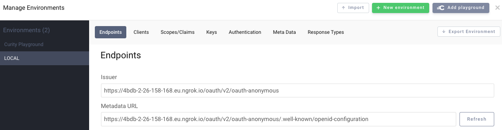
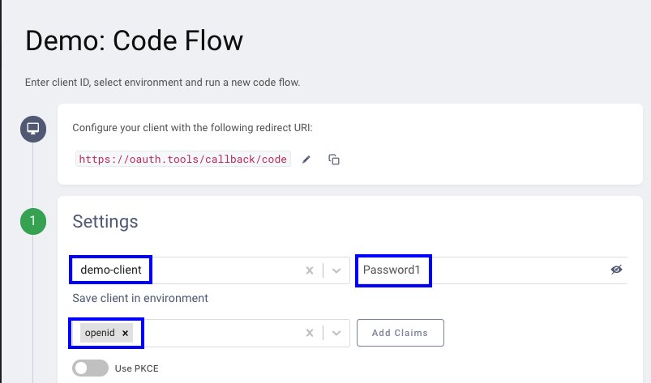
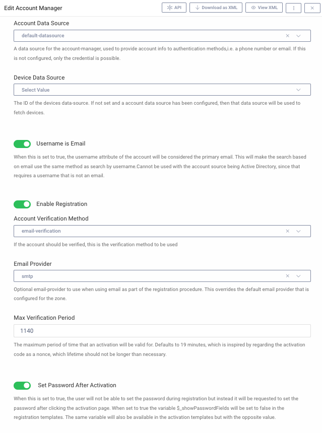
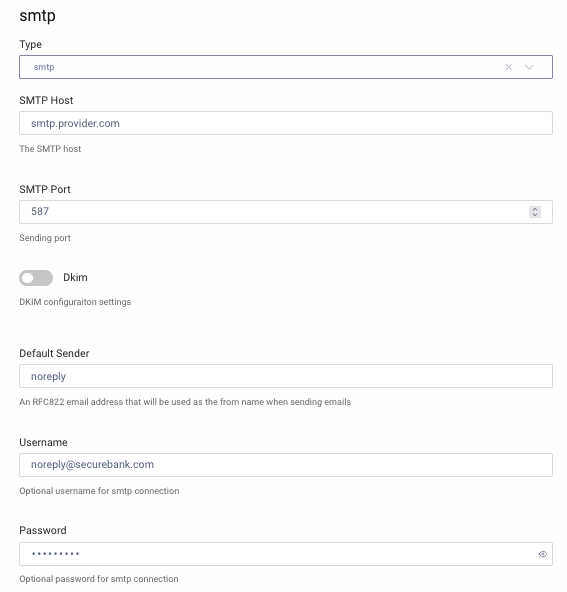
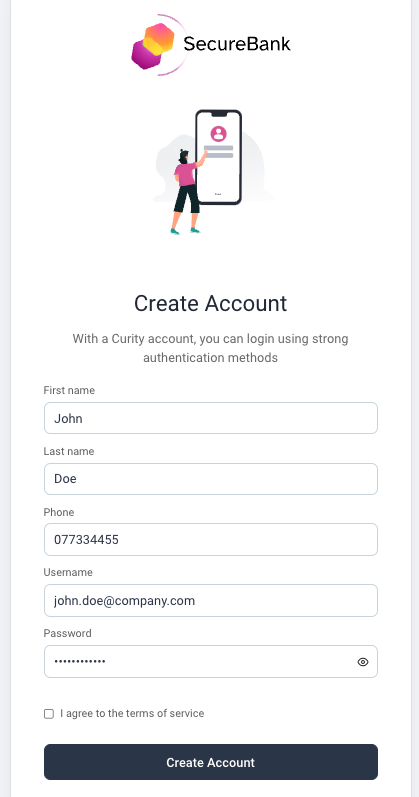
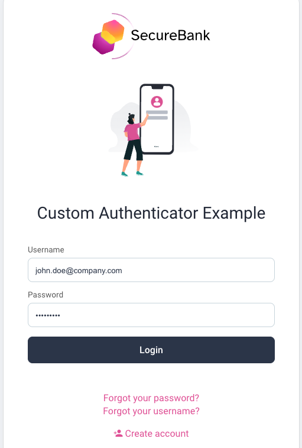

# Test the Plugin

The below deployment uses the ngrok tool to enable a productive test setup when working on the plugin.\
If preferred, the deployment can be studied and adapted to your own requirements.

## Prerequisites

Download a `license.json` file for the Curity Identity Server and copy it into the `test` folder.\
Also ensure that these tools are installed on your local computer:

- [Docker](https://www.docker.com/products/docker-desktop)
- [ngrok](https://ngrok.com/download)

## Deploy the Plugin

First do a docker pull to ensure that your latest tag for the Curity Identity Server is updated:

```bash
docker pull curity.azurecr.io/curity/idsvr
```

Whenever you change the plugin code, build it into deployable JAR files.\
The build script does so by producing a custom Docker image for the Curity Identity Server:

```bash
./test/build.sh
```

The example deployment enables the internet based OAuth Tools to be used as a test client.\
The deployment script uses ngrok to expose port 8443 of the local identity server to OAuth Tools:

```bash
./test/deploy.sh
```

The script outputs an external base URL that can be pasted into OAuth tools:

```text
https://4bdb-2-26-158-168.eu.ngrok.io/oauth/v2/oauth-anonymous/.well-known/openid-configuration
```

## Configure OAuth Tools

Browse to https://oauth.tools and create an environment from the metadata URL:



In the `Code Flow` window, configure the three values highlighted below:



## Configure the Curity Identity Server

Login to the admin UI at this URL, with credentials `admin / Password1`:

- https://localhost:6749/admin

From the `Facilities` menu, configure the account manager options according to your preferences:



To use email features for account activation and recovery, update the email provider settings:



## Test Password Flows

Run a code flow from OAuth tools to perform end-to-end testing of password flows.\
Whenever the system is deployed, select `Create Account` and register a user:



Activate the user if required, then test logins and account recovery behaviour:



## Free Resources

When finished testing, run this command to free Docker and ngrok resources:

```bash
./test/teardown.sh
```
