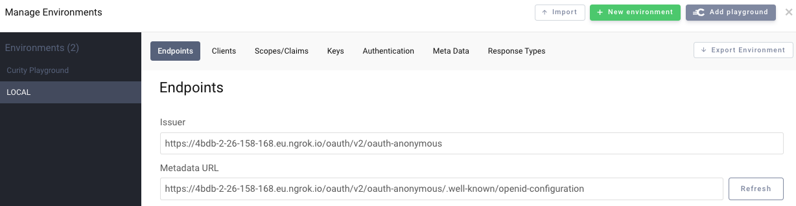
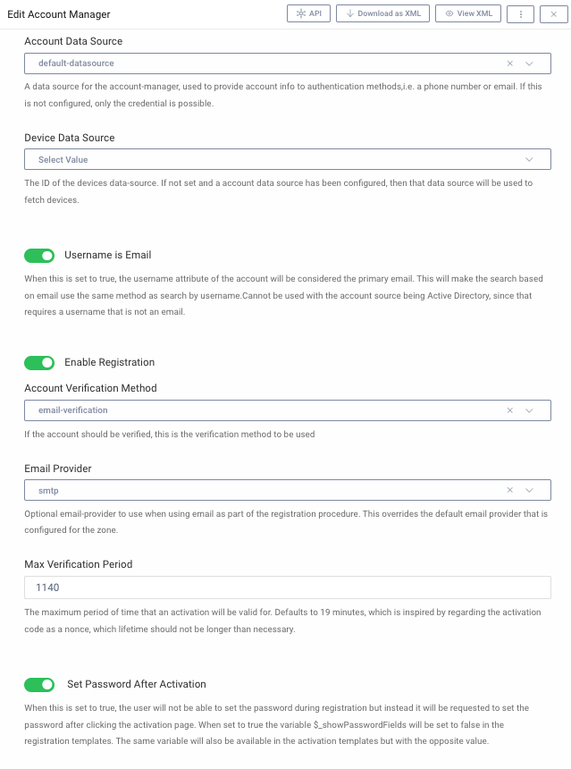
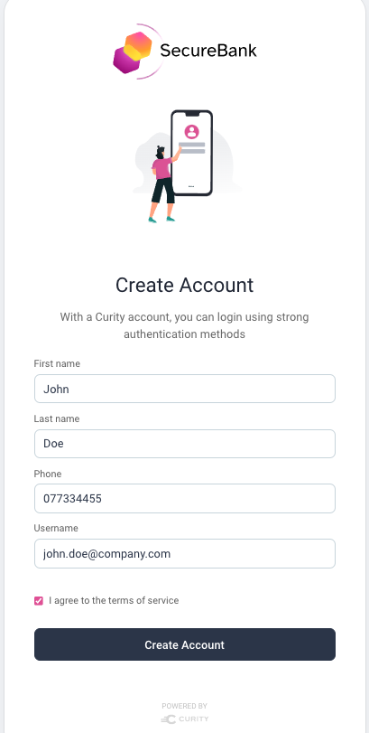
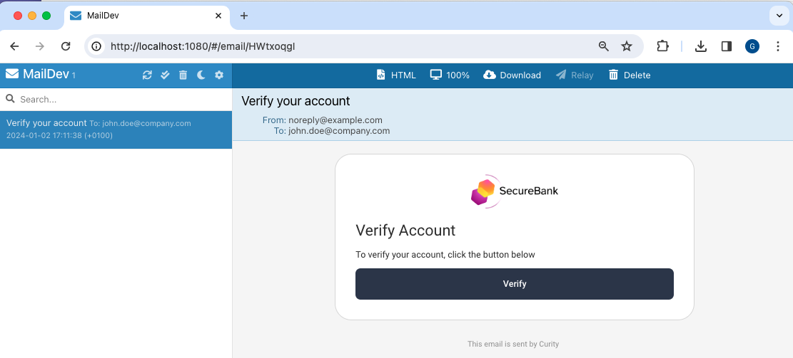
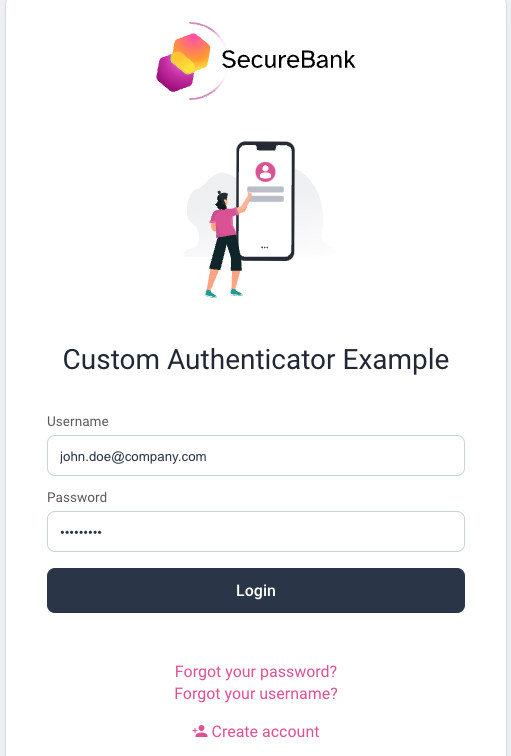

# Test the Plugin

The below deployment uses the ngrok tool to enable a productive test setup when working on the plugin.  
If preferred, the deployment can be studied and adapted to your own requirements.

## Prerequisites

Download a `license.json` file for the Curity Identity Server and copy it into the `test` folder.  
Also ensure that these tools are installed on your local computer:

- [Docker](https://www.docker.com/products/docker-desktop)
- [ngrok](https://ngrok.com/download)

## Deploy the Plugin

First do a docker pull to ensure that your latest tag for the Curity Identity Server is updated:

```bash
docker pull curity.azurecr.io/curity/idsvr
```

Whenever you change the plugin code, build it into deployable JAR files.  
The build script builds the JAR files and creates a custom Docker image for the Curity Identity Server with the plugin:

```bash
./test/build.sh
```

The example deployment enables the internet based OAuth Tools to be used as a test client.  
The deployment script uses ngrok to expose port 8443 of the local Curity Identity Server to OAuth Tools:

```bash
./test/deploy.sh
```

The script outputs an external base URL that can be pasted into OAuth tools:

```text
https://4bdb-2-26-158-168.eu.ngrok.io/oauth/v2/oauth-anonymous/.well-known/openid-configuration
```

## Configure OAuth Tools

Browse to https://oauth.tools and create an environment from the metadata URL:



Add a `code flow` and configure these values:

- client ID: demo-web-client
- client secret: Password1
- scope: openid
- prompt: login

## Configure the Curity Identity Server

Login to the admin UI at this URL, with credentials `admin / Password1`:

- https://localhost:6749/admin

From the `Facilities` menu, configure the account manager options according to your preferences:



For example, select `email-verification` as the account verification method.   
The deployment already includes a mock SMTP server called `smtp` that you can select.

## Test Password Operations for Browser-Based Flows

Run a code flow from OAuth tools to perform end-to-end testing of password flows.  

Select one of the supported password flows. To test the custom plugin, select `usernamepassword`

The deployment config does not contain any user account. For new deployments, therefore, select `Create Account` and register a user:



Activate the user if required. You can access account verification emails by browsing to the mock SMTP server at `http://localhost:1080`:



Test logins and account recovery behavior: 



## Test Password Operations with Native Forms using the Hypermedia Authentication API

Clone the HAAPI code examples with these commands:

```bash
git clone https://github.com/curityio/android-haapi-ui-sdk-demo
git clone https://github.com/curityio/ios-haapi-ui-sdk-demo
```

Edit configuration files and change the base URL to the ngrok value, then run the apps:

- For Android, the configuration file is at `app/src/main/java/io/curity/haapidemo/Configuration.kt`.
- For iOS, the configuration file is at `iOS/Configuration.swift`.

## Query User Account and Credential Data

Get a shell to the postgres Docker container:

```bash
POSTGRES_CONTAINER_ID=$(docker ps | grep postgres | awk '{print $1}')
docker exec -it $POSTGRES_CONTAINER_ID bash
```

Then connect to the database:

```bash
export PGPASSWORD=Password1 && psql -p 5432 -d idsvr -U postgres
```

Then run queries to see how users and their passwords are stored and updated:

```sql
select * from accounts;
select * from credentials;
```

## Free Resources

When finished testing, run this command to free Docker and ngrok resources:

```bash
./test/teardown.sh
```
